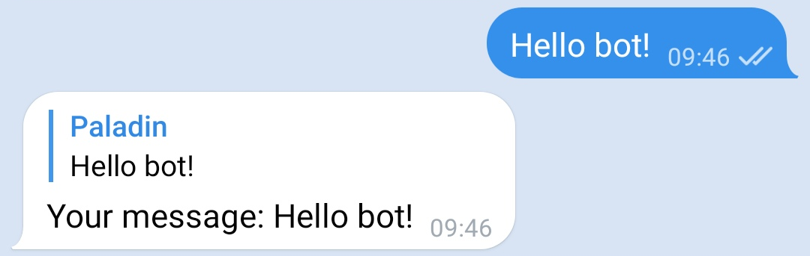

# EchoBot

Simple bot that replies to user text messages

### Run

**Don't forget to change bot token!**

##### With meson:

    $ meson setup --prefix=~/.local build
    $ cd build
    $ ninja install
    $ echo-bot

##### With command

    $ vala --pkg telegram-glib-0.3 src/main.vala

### Result

