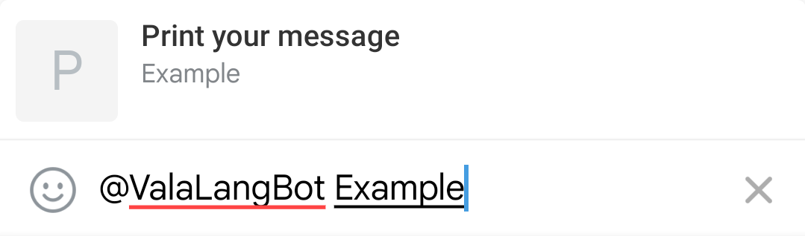

# InlineBot

Example bot with inline support  
**Requires 'Inline Mode' to be enabled in @BotFather**

### Run

**Don't forget to change bot token!**

##### With meson:

    $ meson setup --prefix=~/.local build
    $ cd build
    $ ninja install
    $ inline-bot

##### With command

    $ vala --pkg telegram-glib-0.3 src/main.vala

### Result

